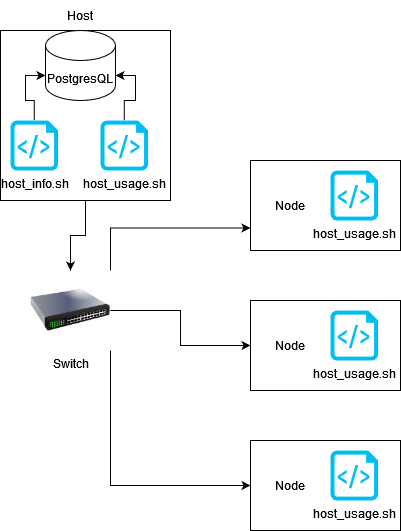

# Linux Cluster Monitoring Agent

# Introduction
This is a monitoring tool for the Jarvis Linux Cluster Administration (LCA) team. This tool will be able to store and track the hardware specifications of each node as well as monitor their resources. The tech powering this tool is bash scripts which will access a postgres database, while the entire project will be containerized using Docker.

# Quick start
- Ensure Docker and Postgresql are installed on your machine
- Start a psql instance using `psql_docker.sh create` on host node
- Run `host_info.sh` on each node
- Schedule crontab to execute `host_usage.sh` every minute for each node

# Implementation
This tool was implemented using bash scripts and the database was containerized in Docker

## Architecture

## Scripts
```
linux_sql
├── assets
├── README.md
├── scripts
│   ├── host_info.sh
│   ├── host_usage.sh
│   └── psql_docker.sh
└── sql
    ├── ddl.sql
    └── queries.sql
```
## Database Modelling

### Host Info Table

| column | description |
| ------ | ----------- |
| id | Postgres ID |
| hostname | Name of node |
| cpu\_number | Node CPU cores |
| cpu\_architecture | Node CPU architecture (e.g. x86) |
| cpu\_model | Node CPU model |
| cpu\_mhz | Node CPU clock speed |
| L2\_cache | Node CPU L2 cache |
| total\_mem | Node total RAM |
| timestamp | Date hardware info captured |

### Host Usage Table

| column | description |
| ------ | ----------- |
| timestamp | Date/Time node usage was captured |
| host\_id | Postgres ID of node machine (references Host Info id) |
| memory\_free | The amount of RAM available to node |
| cpu\_idle | The percent free processing power in node |
| cpu\_kernel | Node OS kernel |
| disk\_io | Node disk space |
| disk\_available | Free disk space available |

# Deployment

- Run `psql_docker.sh start`
- Run `host_info.sh`
- Open crontab using `crontab -e`
- add `* * * * * bash /home/centos/dev/jrvs/bootcamp/linux_sql/host_agent/scripts/host_usage.sh localhost 5432 host_agent postgres password > /tmp/host_usage.log` to crontab 

# Improvements
- I would like to optimize my postgresql queries
- I think that deployment could be smoother with more automation
